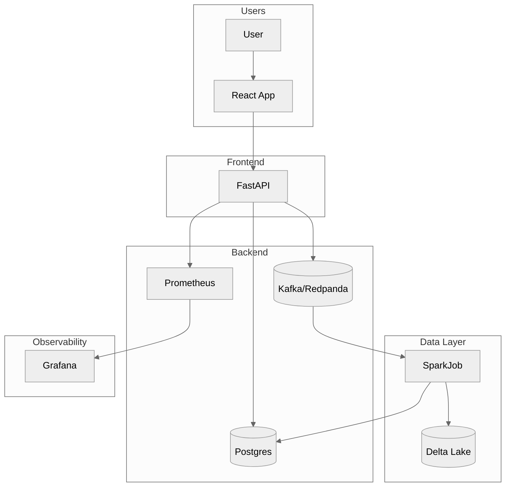

<!-- markdownlint-disable MD041 -->
# Architecture

This document describes the high‑level design of the Intelligent Data Quality
Platform. The goal of the platform is to provide an extensible and observable
framework for defining, executing and monitoring data quality rules across
batch and streaming pipelines.

## Overview

The system consists of three primary components:

1. **Backend** – A FastAPI application responsible for exposing a REST API for
   managing datasets, rules, incidents and authentication. It also emits
   metrics for every request and persists state in Postgres.
2. **Quality job** – A scheduled job implemented in Python/Spark that reads
   datasets from Delta Lake, applies the defined rules and writes check runs
   and incidents back into Postgres. The job also publishes metrics about
   checks run and durations.
3. **Frontend** – A React application powered by Vite and TypeScript. It
   communicates with the backend via JSON APIs, authenticates users, renders
   dashboards using Recharts and allows creation and acknowledgement of
   incidents.

Streaming data is optionally ingested via Kafka (Redpanda in local
environments). For the demo mode Kafka can be disabled and the job reads
batches directly from local files.

## Data flow

The following diagram illustrates the flow of data and control through the
platform:

1. Users interact with the React front‑end which calls the backend REST API.
2. The backend persists rule definitions and incidents in Postgres, and
   optionally publishes data events to Kafka for downstream consumers.
3. The quality job runs on a schedule or continuously in streaming mode. It
   reads datasets from Delta Lake (simulated with pandas in this implementation),
   evaluates each rule, records check runs and creates incidents when rules
   fail.
4. Both the backend and the quality job emit metrics to Prometheus. Grafana
   visualises these metrics via prebuilt dashboards.

## Module breakdown

### Backend (`backend/app`)

- **`main.py`** constructs the FastAPI app, configures CORS, metrics middleware
  and mounts the API routers.
- **`api/`** contains route handlers grouped by resource (auth, datasets,
  rules, incidents, health). Each route uses dependency injection for
  database access, security and RBAC checks.
- **`core/`** houses configuration (`config.py`), security utilities
  (`security.py`), role‑based access control (`rbac.py`), rate limiting and
  structured logging.
- **`db/`** defines SQLModel models representing users, datasets, rules,
  incidents and related entities. It also provides functions for creating the
  database schema and seeding it with sample data.
- **`services/`** implements business logic including the rule engine and a
  quality service that orchestrates running checks on datasets.
- **`telemetry/`** defines Prometheus metrics counters and a middleware for
  recording HTTP request metrics.

### Job layer (`backend/jobs`)

- **`run_quality_job.py`** is the entry point for the quality job. It can be
  invoked manually (`make spark-job`) or scheduled via cron. It loads
  datasets and rules from Postgres and delegates execution to
  `QualityService`.
- **`spark_checks.py`** contains a pandas-based implementation of the various
  quality checks. When running with Spark/Delta Lake this module would be
  replaced by a distributed implementation.
- **`schema_registry.py`** provides helper functions to persist and compare
  dataset schemas for drift detection.

### Frontend (`frontend/src`)

The front‑end is organised by feature rather than by type. Components live in
`components/`, pages in `pages/` and reusable hooks in `lib/`. The UI uses
React Router for navigation and React Query for data fetching/caching.

## Design decisions

| Decision                                 | Rationale                                                               |
|-----------------------------------------|-------------------------------------------------------------------------|
| Use FastAPI + SQLModel                   | FastAPI provides type‑hinted, high‑performance APIs; SQLModel offers an ORM built on SQLAlchemy and pydantic. |
| Spark job decoupled from API            | Heavy computation should not block request handling; jobs can scale independently. |
| Prometheus & Grafana for observability   | They are industry standard, flexible and easy to run locally via Docker. |
| Role‑based access via dependency        | RBAC implemented as an injectable dependency keeps route logic clean.    |
| Pandas in demo mode                      | Provides a simple fallback when Spark is unavailable in a local setup.   |

Future iterations could replace the pandas implementation with Spark +
Delta Lake, integrate streaming via Kafka in earnest and add OpenLineage for
data lineage. See the [Roadmap](product/ROADMAP.md) for more details.