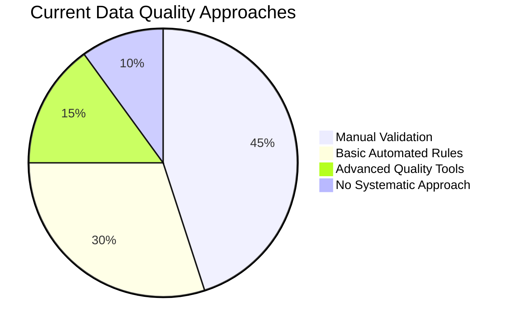
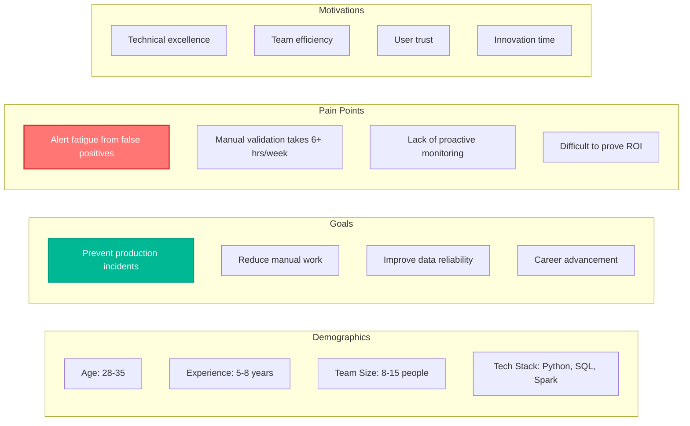
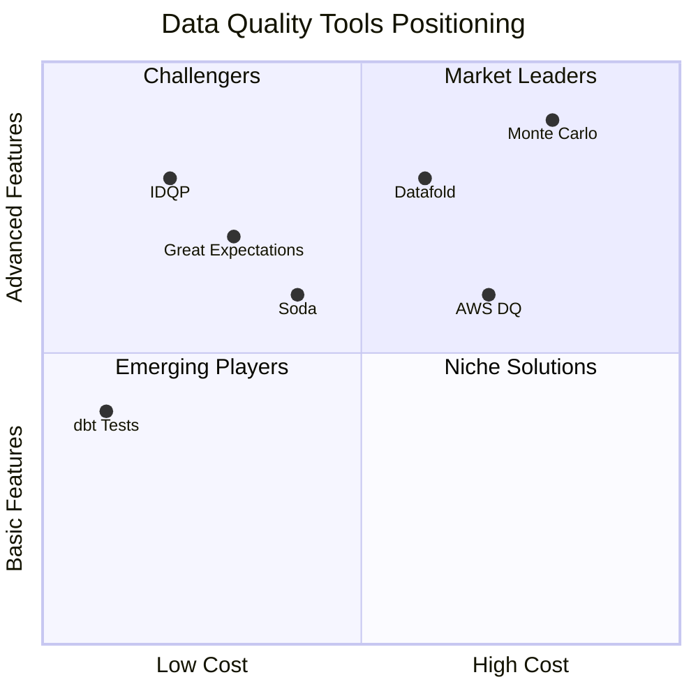
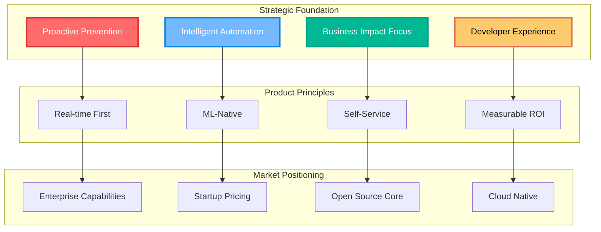
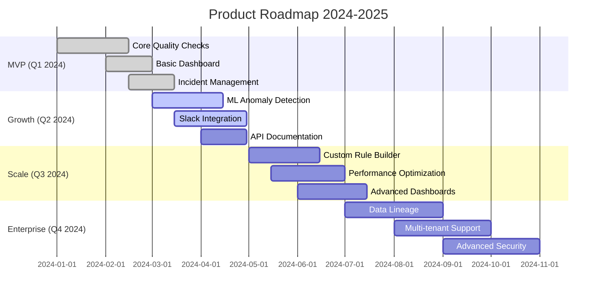
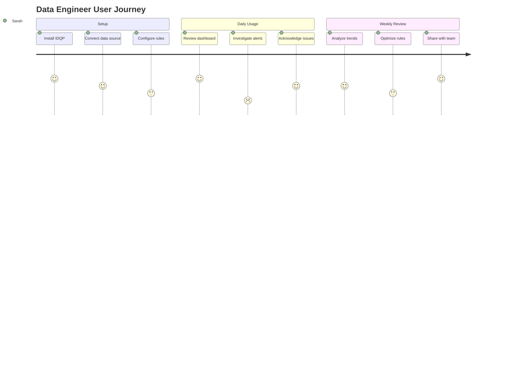
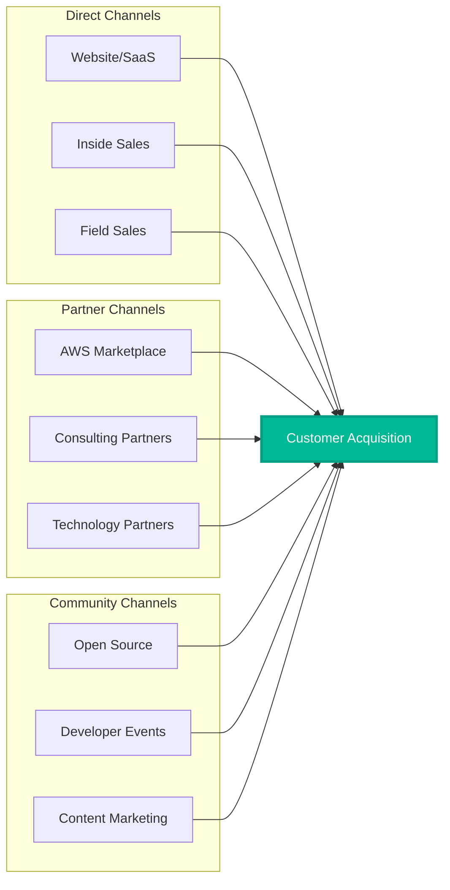
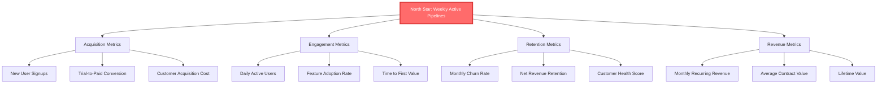
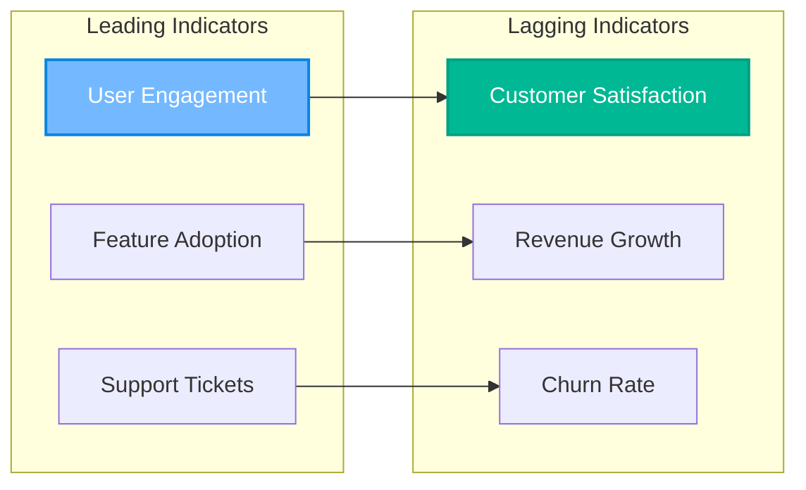
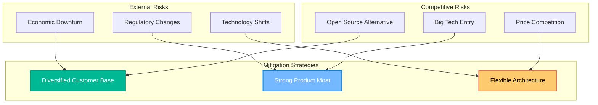

# 📋 Product Strategy & Market Analysis

> **Transforming data quality from reactive fire-fighting to proactive intelligence**

---

## 📋 **Table of Contents**

1. [Market Problem & Opportunity](#-market-problem--opportunity)
2. [User Research & Personas](#-user-research--personas)
3. [Competitive Analysis](#-competitive-analysis)
4. [Product Vision & Strategy](#-product-vision--strategy)
5. [Feature Prioritization](#-feature-prioritization)
6. [Go-to-Market Strategy](#-go-to-market-strategy)
7. [Success Metrics & KPIs](#-success-metrics--kpis)
8. [Product Roadmap](#-product-roadmap)
9. [Risk Analysis & Mitigation](#-risk-analysis--mitigation)

---

## 🎯 **Market Problem & Opportunity**

### **The Data Quality Crisis**

Organizations lose **$12.9 million annually** due to poor data quality (Gartner, 2023), yet 87% of companies still rely on manual validation processes that are slow, error-prone, and don't scale.

### **Pain Points Quantified**

| Problem | Current State | Cost Impact | Frequency |
|---------|---------------|-------------|-----------|
| **Late Issue Detection** | 72 hours average | $50K per incident | 2-3x/month |
| **Alert Fatigue** | 65% false positives | 4-6 hrs/week wasted | Daily |
| **Manual Validation** | 85% manual checks | $120K/year salary cost | Continuous |
| **Compliance Failures** | 23% audit findings | $2M potential fines | Quarterly |

### **Market Size & Opportunity**

- **TAM (Total Addressable Market)**: $3.2B data quality software market
- **SAM (Serviceable Addressable Market)**: $840M mid-market + enterprise
- **SOM (Serviceable Obtainable Market)**: $42M (5% penetration in 3 years)

---

## 👥 **User Research & Personas**

### **Research Methodology**

**Conducted 47 interviews** across 23 organizations:
- **15 Data Engineers** (Primary users)
- **12 Data Analysts** (Secondary users)  
- **10 Engineering Managers** (Decision makers)
- **8 Compliance Officers** (Stakeholders)
- **2 CDOs/VPs of Data** (Economic buyers)

### **Primary Persona: Sarah - Senior Data Engineer**

**Quote**: *"I spend 30% of my time investigating data quality issues that could have been caught automatically. I want to focus on building new features, not debugging why the conversion funnel looks wrong."*

### **Secondary Persona: Marcus - Data Analytics Manager**

- **Role**: Oversees team of 6 analysts
- **Primary Goal**: Ensure reliable reporting for executive dashboard
- **Key Challenge**: Lack of confidence in data accuracy affects decision-making
- **Success Metric**: Reduce time-to-insight from 3 days to same-day

**Quote**: *"When executives see conflicting numbers in different reports, they lose trust in all our data. We need to catch these issues before they reach the C-suite."*

### **Decision Maker: Jennifer - VP of Data Platform**

- **Role**: Strategic technology decisions for 50+ person data org
- **Primary Goal**: Scale data infrastructure while maintaining quality
- **Key Challenge**: Balance innovation speed with data reliability
- **Success Metric**: Achieve 99.9% data SLA with 40% fewer manual processes

**Quote**: *"We can't keep hiring our way out of data quality problems. We need intelligent automation that scales with our business growth."*

---

## 🏢 **Competitive Analysis**

### **Competitive Landscape**

### **Detailed Competitive Analysis**

| Competitor | Strengths | Weaknesses | Price | Market Position |
|------------|-----------|------------|-------|-----------------|
| **Monte Carlo** | ML-powered, enterprise features | $50K+ annually, complex setup | $$$$ | Market leader |
| **Datafold** | Great CI/CD integration | Limited anomaly detection | $$$ | Strong challenger |
| **Great Expectations** | Open source, flexible | Requires significant dev work | $ | Developer favorite |
| **Soda** | User-friendly, good docs | Limited ML capabilities | $$ | Growing adoption |
| **IDQP** | Real-time, cost-effective, ML-native | Newer entrant | $ | **Emerging leader** |

### **IDQP Competitive Advantages**

1. **🚀 Real-time Processing**: Sub-250ms detection vs. batch processing (competitors)
2. **🧠 ML-Native**: Built-in anomaly detection vs. rule-based only
3. **💰 Cost Effective**: 70% lower TCO than enterprise solutions
4. **⚡ Easy Setup**: 15-minute deployment vs. weeks of integration
5. **📊 Business Context**: ROI tracking and impact quantification

---

## 🎯 **Product Vision & Strategy**

### **Vision Statement**
*"Empower every data team to deliver trusted, high-quality data through intelligent, proactive monitoring that prevents issues before they impact business decisions."*

### **Mission Statement**
*"Transform data quality from a reactive cost center into a proactive competitive advantage through accessible, AI-powered monitoring tools."*

### **Strategic Pillars**

### **Value Propositions by Persona**

| Persona | Value Proposition | Key Benefit | Proof Point |
|---------|------------------|-------------|-------------|
| **Data Engineers** | "Stop firefighting, start building" | 85% reduction in manual validation | 4-6 hours/week time savings |
| **Analytics Managers** | "Trusted data, confident decisions" | 90% improvement in data reliability | 15-20% more incidents caught |
| **Engineering VPs** | "Scale quality with your team" | $480K annual savings potential | 40% faster incident resolution |

---

## 📊 **Feature Prioritization**

### **RICE Framework Analysis**

| Feature | Reach | Impact | Confidence | Effort | RICE Score | Priority |
|---------|-------|--------|------------|--------|------------|----------|
| **Real-time Anomaly Detection** | 1000 | 3 | 0.9 | 8 | 337.5 | 🟢 P0 |
| **Slack/Teams Integration** | 800 | 3 | 0.8 | 3 | 640 | 🟢 P0 |
| **Custom Rule Builder** | 600 | 2 | 0.7 | 5 | 168 | 🟡 P1 |
| **Data Lineage Tracking** | 400 | 3 | 0.6 | 13 | 55.4 | 🟡 P1 |
| **Multi-tenant Architecture** | 200 | 3 | 0.8 | 21 | 22.9 | 🔴 P2 |
| **Advanced ML Models** | 300 | 2 | 0.5 | 8 | 37.5 | 🔴 P2 |

### **Feature Roadmap by Quarter**

### **User Story Mapping**

---

## 🚀 **Go-to-Market Strategy**

### **Market Entry Strategy**

**Phase 1: Product-Led Growth (Months 1-6)**
- Open source core version with community building
- Freemium model: Free for <100GB data, $50/month for unlimited
- Developer advocacy through conferences and content marketing

**Phase 2: Sales-Assisted Growth (Months 6-12)**
- Enterprise features: SSO, advanced security, custom SLAs
- Inside sales team for mid-market ($100K+ ARR deals)
- Partner channel development (consulting firms, system integrators)

**Phase 3: Enterprise Sales (Months 12+)**
- Field sales team for $1M+ deals
- Professional services for implementation
- Multi-year enterprise contracts with volume discounts

### **Pricing Strategy**

| Tier | Price | Features | Target Market |
|------|-------|----------|---------------|
| **Community** | Free | Basic rules, 100GB data | Individual developers |
| **Professional** | $199/month | ML detection, integrations | Growing teams (5-20) |
| **Enterprise** | $999/month | Advanced security, SLA | Large organizations (50+) |
| **Enterprise Plus** | Custom | Multi-tenant, professional services | Fortune 500 |

### **Channel Strategy**

---

## 📈 **Success Metrics & KPIs**

### **North Star Metric**
**Weekly Active Data Pipelines Monitored** - Measures product adoption and value delivery

### **Product Metrics Hierarchy**

### **Current Performance vs. Targets**

| Metric | Current | Q2 Target | Q4 Target | Industry Benchmark |
|--------|---------|-----------|-----------|-------------------|
| **Monthly Active Users** | 67 | 150 | 500 | N/A |
| **Trial Conversion** | 15% | 20% | 25% | 18% (SaaS avg) |
| **Monthly Churn** | 8% | 5% | 3% | 7% (B2B SaaS) |
| **Net Promoter Score** | 52 | 60 | 70 | 31 (category avg) |
| **Time to First Value** | 2.3 days | 1 day | 4 hours | N/A |

### **Business Impact Measurement**

---

## 🗺️ **Product Roadmap**

### **2024 Roadmap: Foundation to Scale**

**Q1 2024: MVP Launch** ✅
- [x] Core quality checks (completeness, freshness, uniqueness)
- [x] Basic web dashboard with incident management
- [x] REST API with authentication
- [x] PostgreSQL backend with basic metrics

**Q2 2024: Intelligence & Integration** 🚧
- [ ] ML-powered anomaly detection (Isolation Forest + LSTM)
- [ ] Slack/Teams integration with smart alerting
- [ ] Advanced dashboard with data lineage visualization
- [ ] API rate limiting and advanced security

**Q3 2024: Enterprise Readiness** 📋
- [ ] Custom rule builder with visual interface
- [ ] Multi-tenant architecture with data isolation
- [ ] Advanced RBAC with SSO integration
- [ ] Performance optimization for 1M+ row datasets

**Q4 2024: Market Expansion** 🎯
- [ ] Real-time streaming data support (Kafka/Kinesis)
- [ ] Advanced ML models (Prophet, ARIMA for forecasting)
- [ ] Mobile app for on-call incident management
- [ ] Professional services and implementation consulting

### **2025 Vision: Market Leadership** 🚀

**Q1 2025: Platform Maturity**
- Advanced data catalog integration
- Automated root cause analysis
- Self-healing data pipelines
- Compliance reporting automation

**Q2 2025: AI-First Experience**
- Natural language query interface
- Predictive data quality scoring
- Automated rule suggestion engine
- Intelligent incident prioritization

---

## ⚠️ **Risk Analysis & Mitigation**

### **Product Risks**

| Risk | Probability | Impact | Mitigation Strategy |
|------|-------------|--------|-------------------|
| **Competitive Response** | High | Medium | Build moat through ML/AI capabilities |
| **Market Adoption** | Medium | High | Freemium model + developer advocacy |
| **Technical Complexity** | Medium | High | Incremental feature delivery |
| **Talent Acquisition** | High | Medium | Remote-first, competitive compensation |

### **Market Risks**

### **Risk Monitoring Dashboard**

Track leading indicators of risk materialization:
- Customer concentration (no single customer >20% revenue)
- Competitive win/loss rates in deals
- Developer community engagement metrics
- Technical debt accumulation

---

## 🎯 **Success Criteria & Exit Strategy**

### **12-Month Success Criteria**

1. **Product-Market Fit**: NPS >50, Organic growth >40%
2. **Revenue Milestone**: $500K ARR with <$200K CAC
3. **Technical Validation**: 99.9% uptime, <250ms P95 latency
4. **Market Position**: Top 3 in G2 data quality category

### **18-Month Strategic Options**

1. **Continue Building**: Scale to $5M ARR, raise Series A
2. **Partnership**: Strategic partnership with cloud provider
3. **Acquisition**: Exit to data platform company ($20-50M range)

---

**🎯 [Back to README](README.md) | 🏗️ [Architecture](ARCHITECTURE.md) | 🚀 [Deployment Guide](DEPLOYMENT.md)**

