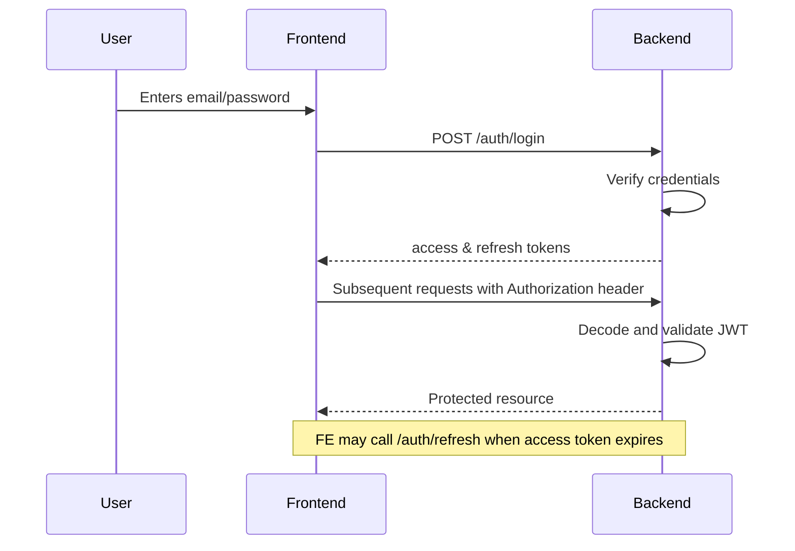

<!-- markdownlint-disable MD041 -->
# Security

This document outlines the security model of the Intelligent Data Quality
Platform. While the platform is intended for demonstration purposes, it
implements a number of best practices that should be preserved and extended
for production deployments.

## Authentication and authorisation

The backend uses **JSON Web Tokens (JWT)** for stateless authentication.
Clients obtain an access and refresh token by posting their credentials to
`/auth/login`. Access tokens have a short TTL (default 60 minutes) and are
submitted in the `Authorization: Bearer` header on subsequent requests.
Refresh tokens expire after one week and are exchanged for new access
tokens via `/auth/refresh`.

Role‑based access control is enforced through a dependency (`require_role`) on
protected routes. Four roles are defined:

| Role       | Permissions                                                      |
|-----------|------------------------------------------------------------------|
| Owner      | Full access: manage datasets, rules, incidents and users        |
| Maintainer | Manage datasets and rules                                       |
| Reviewer   | Acknowledge incidents                                           |
| Viewer     | Read‑only access to datasets, rules and incidents               |

## Threat model

The following table identifies potential risks and the mitigations in place.

| Threat                         | Impact                   | Mitigation                                             |
|-------------------------------|--------------------------|--------------------------------------------------------|
| Stolen credentials            | Unauthorised access      | Use strong salted password hashing (bcrypt); implement account lockout and MFA for production deployments. |
| Token theft                   | Session hijacking        | Use short‑lived access tokens; store tokens in HTTP‑only cookies in the UI; rotate secrets regularly. |
| SQL injection                 | Data corruption/exfiltration | ORM layer (SQLModel) uses parameterised queries; user input is validated via Pydantic. |
| Cross‑site scripting (XSS)    | Client takeover          | React escapes output by default; APIs return JSON only; CORS restricted to configured origin. |
| Rate limiting bypass          | Abuse of sensitive endpoints | Simple token bucket implemented in `rate_limit.py`; configure a distributed limiter like Redis for production. |
| Insecure transport            | Data interception        | Require HTTPS in production; terminate TLS at a load balancer. |
| Supply chain vulnerabilities  | Remote code execution    | CI runs bandit, pip‑audit and npm audit; containers are scanned with Trivy. |
| Privilege escalation          | Data tampering           | Strict role checks on protected routes; ensure tests cover negative cases. |
| Schema drift exploitation     | Downstream breakages     | Schema drift detection compares current schema to stored versions and raises incidents when breaking changes occur. |

## Hardening checklist

- Enforce **HTTPS** for all external connections.
- Store JWTs in **HTTP‑only secure cookies** rather than local storage.
- Rotate the **`SECRET_KEY`** periodically; store it in a secrets manager.
- Configure a **distributed rate limiter** (e.g. Redis or Memcached) instead of the in‑memory token bucket used in demo mode.
- Integrate **Multi‑Factor Authentication (MFA)** for privileged users.
- Use a proper **migrations** framework (Alembic) instead of auto‑creating tables.
- Run the backend behind a **reverse proxy** (e.g. NGINX) configured with security headers like HSTS, CSP, X‑Frame‑Options and X‑Content‑Type‑Options.
- Monitor CI pipelines for **vulnerable dependencies** and apply updates promptly.

## Auth flow sequence

Below is a simplified sequence diagram for the authentication flow:

