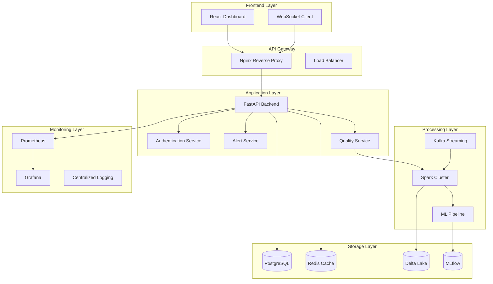

# Architecture Overview

## System Architecture

The Intelligent Data Quality Platform follows a modern microservices architecture designed for enterprise-scale data processing and monitoring.



## Core Components

### 1. Frontend Layer
- **React Dashboard**: Modern, responsive UI built with React 18 and Material-UI
- **Real-time Updates**: WebSocket connections for live data quality monitoring
- **Interactive Visualizations**: D3.js and Recharts for complex data visualizations
- **Progressive Web App**: Offline capabilities and mobile-responsive design

### 2. API Gateway
- **Nginx Reverse Proxy**: High-performance reverse proxy and load balancer
- **SSL Termination**: Handles HTTPS encryption and certificate management
- **Rate Limiting**: Protects backend services from abuse
- **Caching**: Static asset caching and API response caching

### 3. Application Services

#### FastAPI Backend
- **High Performance**: Async/await support with automatic API documentation
- **Authentication**: JWT-based authentication with role-based access control
- **Validation**: Pydantic models for request/response validation
- **Error Handling**: Comprehensive error handling and logging

#### Quality Service
- **Real-time Monitoring**: Continuous quality checks on streaming data
- **Batch Processing**: Scheduled quality assessments on large datasets
- **ML-powered Detection**: Anomaly detection using ensemble methods
- **Custom Rules**: Flexible rule engine for business-specific quality checks

#### Alert Service
- **Intelligent Routing**: ML-based alert prioritization and routing
- **Multi-channel Notifications**: Email, Slack, webhooks, and SMS
- **Escalation Workflows**: Automated escalation based on severity and response time
- **Alert Fatigue Reduction**: Smart deduplication and clustering

### 4. Processing Layer

#### Apache Spark
- **Distributed Processing**: Scales to petabyte-sized datasets
- **Delta Lake Integration**: ACID transactions and time travel capabilities
- **Streaming Analytics**: Real-time processing with structured streaming
- **ML Pipeline**: Integrated machine learning workflows

#### Apache Kafka
- **Event Streaming**: Real-time data ingestion and processing
- **High Throughput**: Handles millions of messages per second
- **Fault Tolerance**: Distributed architecture with replication
- **Schema Registry**: Evolving data schemas with compatibility checks

### 5. Storage Layer

#### PostgreSQL
- **Metadata Storage**: Quality check definitions, user data, and configurations
- **ACID Compliance**: Ensures data consistency and reliability
- **Advanced Indexing**: Optimized for fast query performance
- **Replication**: Master-slave setup for high availability

#### Redis
- **Session Management**: User sessions and authentication tokens
- **Caching**: Frequently accessed data and query results
- **Message Queues**: Background job processing
- **Real-time Analytics**: Live dashboards and metrics

#### Delta Lake
- **Data Lake Storage**: Scalable storage for structured and semi-structured data
- **Time Travel**: Historical data analysis and rollback capabilities
- **Schema Evolution**: Automatic schema inference and evolution
- **Optimizations**: File compaction and indexing for performance

#### MLflow
- **Model Lifecycle Management**: Version control for ML models
- **Experiment Tracking**: Compare and reproduce ML experiments
- **Model Registry**: Centralized model storage and deployment
- **A/B Testing**: Model performance comparison in production

### 6. Monitoring Layer

#### Prometheus
- **Metrics Collection**: Application and infrastructure metrics
- **Time Series Database**: Efficient storage and querying of metrics
- **Alerting Rules**: Automated alerts based on metric thresholds
- **Service Discovery**: Automatic discovery of monitored services

#### Grafana
- **Visualization**: Rich dashboards for metrics and logs
- **Alerting**: Visual alerts and notifications
- **Multi-data Source**: Combines metrics, logs, and traces
- **Custom Dashboards**: Role-based dashboard access

## Data Flow Architecture

### 1. Real-time Data Quality Pipeline
```
Data Sources → Kafka → Spark Streaming → Quality Checks → Delta Lake → Alerts
```

### 2. Batch Processing Pipeline
```
Data Lake → Spark Batch → Quality Analysis → ML Models → Reports → Notifications
```

### 3. ML Pipeline
```
Historical Data → Feature Engineering → Model Training → Model Validation → Deployment → Monitoring
```

## Scalability Design

### Horizontal Scaling
- **Microservices**: Independent scaling of different components
- **Container Orchestration**: Kubernetes for automatic scaling
- **Load Balancing**: Distribute traffic across multiple instances
- **Database Sharding**: Partition data across multiple databases

### Vertical Scaling
- **Resource Optimization**: CPU and memory tuning for each service
- **Cache Optimization**: Multi-level caching strategy
- **Query Optimization**: Database indexing and query tuning
- **Connection Pooling**: Efficient database connection management

### Performance Optimization
- **Lazy Loading**: Load data only when needed
- **Pagination**: Limit data transfer for large datasets
- **Compression**: Reduce data transfer overhead
- **CDN Integration**: Global content delivery for static assets

## Security Architecture

### Authentication & Authorization
- **JWT Tokens**: Stateless authentication with refresh tokens
- **RBAC**: Role-based access control with fine-grained permissions
- **OAuth Integration**: Support for enterprise identity providers
- **API Keys**: Service-to-service authentication

### Data Security
- **Encryption at Rest**: AES-256 encryption for stored data
- **Encryption in Transit**: TLS 1.3 for all network communication
- **Data Masking**: PII protection in non-production environments
- **Audit Logging**: Comprehensive logging of all data access

### Network Security
- **VPC**: Isolated network environment
- **Firewall Rules**: Restrict access to authorized sources
- **Intrusion Detection**: Monitor for security threats
- **DDoS Protection**: Automatic mitigation of attacks

## Disaster Recovery

### Backup Strategy
- **Automated Backups**: Regular backups of all critical data
- **Cross-region Replication**: Geographically distributed backups
- **Point-in-time Recovery**: Restore to any point in time
- **Backup Testing**: Regular restoration tests

### High Availability
- **Multi-zone Deployment**: Services distributed across availability zones
- **Health Checks**: Automatic failover for unhealthy instances
- **Circuit Breakers**: Prevent cascade failures
- **Graceful Degradation**: Maintain core functionality during outages

### Recovery Procedures
- **RTO**: Recovery Time Objective < 15 minutes
- **RPO**: Recovery Point Objective < 5 minutes
- **Automated Failover**: Minimize manual intervention
- **Rollback Procedures**: Quick rollback for problematic deployments
