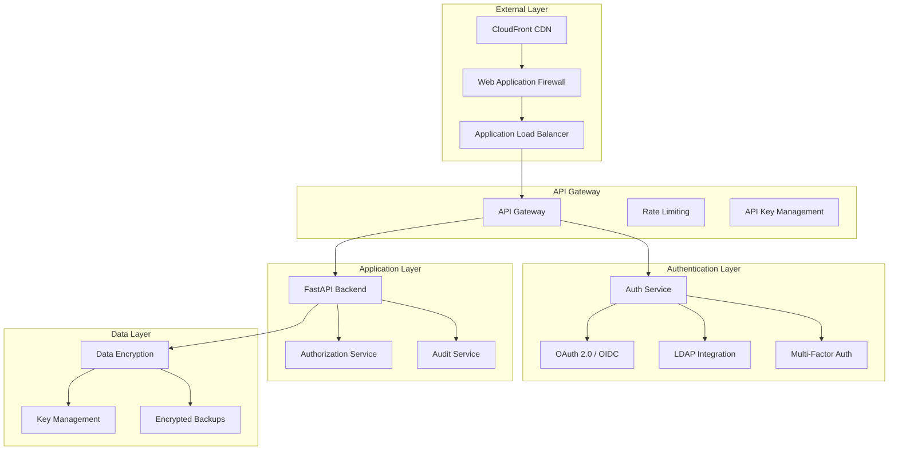

# Security Implementation Guide

## Overview

This document outlines the comprehensive security implementation for the Intelligent Data Quality Platform, covering authentication, authorization, data protection, and security best practices.

## Security Architecture



## Authentication & Authorization

### JWT Token Implementation

```python
# app/core/security.py
import jwt
from datetime import datetime, timedelta
from typing import Optional, Dict, Any
from fastapi import HTTPException, Depends, status
from fastapi.security import HTTPBearer, HTTPAuthorizationCredentials
from passlib.context import CryptContext
import secrets
import redis

class SecurityManager:
    """Comprehensive security management"""
    
    def __init__(self):
        self.pwd_context = CryptContext(schemes=["bcrypt"], deprecated="auto")
        self.secret_key = self._get_secret_key()
        self.algorithm = "HS256"
        self.access_token_expire = timedelta(minutes=30)
        self.refresh_token_expire = timedelta(days=7)
        self.redis_client = redis.Redis(host='localhost', port=6379, db=0)
        
    def _get_secret_key(self) -> str:
        """Securely retrieve or generate secret key"""
        import os
        secret_key = os.getenv("JWT_SECRET_KEY")
        if not secret_key:
            # Generate a secure random key
            secret_key = secrets.token_urlsafe(32)
            # In production, store this in a secure key vault
        return secret_key
    
    def create_access_token(self, data: Dict[str, Any], expires_delta: Optional[timedelta] = None) -> str:
        """Create JWT access token"""
        to_encode = data.copy()
        if expires_delta:
            expire = datetime.utcnow() + expires_delta
        else:
            expire = datetime.utcnow() + self.access_token_expire
        
        to_encode.update({
            "exp": expire,
            "iat": datetime.utcnow(),
            "jti": secrets.token_urlsafe(16),  # Unique token ID
            "type": "access"
        })
        
        encoded_jwt = jwt.encode(to_encode, self.secret_key, algorithm=self.algorithm)
        
        # Store token metadata in Redis for revocation
        self._store_token_metadata(to_encode["jti"], to_encode["sub"], expire)
        
        return encoded_jwt
    
    def create_refresh_token(self, user_id: str) -> str:
        """Create JWT refresh token"""
        to_encode = {
            "sub": user_id,
            "exp": datetime.utcnow() + self.refresh_token_expire,
            "iat": datetime.utcnow(),
            "jti": secrets.token_urlsafe(16),
            "type": "refresh"
        }
        
        encoded_jwt = jwt.encode(to_encode, self.secret_key, algorithm=self.algorithm)
        self._store_token_metadata(to_encode["jti"], user_id, to_encode["exp"])
        
        return encoded_jwt
    
    def verify_token(self, token: str) -> Dict[str, Any]:
        """Verify and decode JWT token"""
        try:
            payload = jwt.decode(token, self.secret_key, algorithms=[self.algorithm])
            
            # Check if token is revoked
            if self._is_token_revoked(payload.get("jti")):
                raise HTTPException(
                    status_code=status.HTTP_401_UNAUTHORIZED,
                    detail="Token has been revoked"
                )
            
            return payload
            
        except jwt.ExpiredSignatureError:
            raise HTTPException(
                status_code=status.HTTP_401_UNAUTHORIZED,
                detail="Token has expired"
            )
        except jwt.JWTError:
            raise HTTPException(
                status_code=status.HTTP_401_UNAUTHORIZED,
                detail="Invalid token"
            )
    
    def _store_token_metadata(self, jti: str, user_id: str, expires: datetime):
        """Store token metadata for revocation tracking"""
        key = f"token:{jti}"
        value = {
            "user_id": user_id,
            "expires": expires.timestamp()
        }
        ttl = int((expires - datetime.utcnow()).total_seconds())
        self.redis_client.setex(key, ttl, str(value))
    
    def _is_token_revoked(self, jti: str) -> bool:
        """Check if token is revoked"""
        revoked_key = f"revoked_token:{jti}"
        return self.redis_client.exists(revoked_key)
    
    def revoke_token(self, jti: str):
        """Revoke a specific token"""
        revoked_key = f"revoked_token:{jti}"
        self.redis_client.setex(revoked_key, 3600 * 24 * 7, "revoked")  # 7 days TTL
    
    def hash_password(self, password: str) -> str:
        """Hash password using bcrypt"""
        return self.pwd_context.hash(password)
    
    def verify_password(self, plain_password: str, hashed_password: str) -> bool:
        """Verify password against hash"""
        return self.pwd_context.verify(plain_password, hashed_password)

# Dependency for authentication
security_bearer = HTTPBearer()
security_manager = SecurityManager()

async def get_current_user(credentials: HTTPAuthorizationCredentials = Depends(security_bearer)):
    """Extract current user from JWT token"""
    token = credentials.credentials
    payload = security_manager.verify_token(token)
    
    user_id = payload.get("sub")
    if user_id is None:
        raise HTTPException(
            status_code=status.HTTP_401_UNAUTHORIZED,
            detail="Invalid token"
        )
    
    # Fetch user from database
    user = await get_user_by_id(user_id)
    if user is None:
        raise HTTPException(
            status_code=status.HTTP_401_UNAUTHORIZED,
            detail="User not found"
        )
    
    return user
```

### Role-Based Access Control (RBAC)

```python
# app/core/authorization.py
from enum import Enum
from typing import List, Dict, Any
from functools import wraps
from fastapi import HTTPException, status

class Permission(Enum):
    """System permissions"""
    READ_DATASETS = "read:datasets"
    WRITE_DATASETS = "write:datasets"
    DELETE_DATASETS = "delete:datasets"
    READ_QUALITY_CHECKS = "read:quality_checks"
    WRITE_QUALITY_CHECKS = "write:quality_checks"
    READ_ALERTS = "read:alerts"
    WRITE_ALERTS = "write:alerts"
    MANAGE_USERS = "manage:users"
    ADMIN_ACCESS = "admin:access"
    SYSTEM_CONFIG = "system:config"

class Role(Enum):
    """System roles"""
    VIEWER = "viewer"
    ANALYST = "analyst"
    DATA_ENGINEER = "data_engineer"
    ADMIN = "admin"
    SUPER_ADMIN = "super_admin"

# Role permission mapping
ROLE_PERMISSIONS = {
    Role.VIEWER: [
        Permission.READ_DATASETS,
        Permission.READ_QUALITY_CHECKS,
        Permission.READ_ALERTS
    ],
    Role.ANALYST: [
        Permission.READ_DATASETS,
        Permission.READ_QUALITY_CHECKS,
        Permission.WRITE_QUALITY_CHECKS,
        Permission.READ_ALERTS
    ],
    Role.DATA_ENGINEER: [
        Permission.READ_DATASETS,
        Permission.WRITE_DATASETS,
        Permission.READ_QUALITY_CHECKS,
        Permission.WRITE_QUALITY_CHECKS,
        Permission.READ_ALERTS,
        Permission.WRITE_ALERTS
    ],
    Role.ADMIN: [
        Permission.READ_DATASETS,
        Permission.WRITE_DATASETS,
        Permission.DELETE_DATASETS,
        Permission.READ_QUALITY_CHECKS,
        Permission.WRITE_QUALITY_CHECKS,
        Permission.READ_ALERTS,
        Permission.WRITE_ALERTS,
        Permission.MANAGE_USERS
    ],
    Role.SUPER_ADMIN: [perm for perm in Permission]  # All permissions
}

class AuthorizationService:
    """Authorization and permission checking"""
    
    def __init__(self):
        self.role_permissions = ROLE_PERMISSIONS
    
    def has_permission(self, user_roles: List[str], required_permission: Permission) -> bool:
        """Check if user has required permission"""
        for role_name in user_roles:
            try:
                role = Role(role_name)
                if required_permission in self.role_permissions.get(role, []):
                    return True
            except ValueError:
                continue
        return False
    
    def has_resource_access(self, user_id: str, resource_type: str, resource_id: str, action: str) -> bool:
        """Check resource-level access control"""
        # Implement resource-level access control logic
        # This could check ownership, team membership, etc.
        
        # Example: Check if user owns the dataset
        if resource_type == "dataset" and action in ["write", "delete"]:
            return self._check_dataset_ownership(user_id, resource_id)
        
        return True  # Default allow for read operations
    
    def _check_dataset_ownership(self, user_id: str, dataset_id: str) -> bool:
        """Check if user owns or has access to dataset"""
        # Implementation would check database for ownership/team membership
        # This is a simplified version
        return True

# Authorization decorator
def require_permission(permission: Permission):
    """Decorator to require specific permission"""
    def decorator(func):
        @wraps(func)
        async def wrapper(*args, **kwargs):
            # Get current user from context
            current_user = kwargs.get('current_user')
            if not current_user:
                raise HTTPException(
                    status_code=status.HTTP_401_UNAUTHORIZED,
                    detail="Authentication required"
                )
            
            auth_service = AuthorizationService()
            if not auth_service.has_permission(current_user.roles, permission):
                raise HTTPException(
                    status_code=status.HTTP_403_FORBIDDEN,
                    detail="Insufficient permissions"
                )
            
            return await func(*args, **kwargs)
        return wrapper
    return decorator

# Resource-level authorization
def require_resource_access(resource_type: str, action: str):
    """Decorator to require resource-level access"""
    def decorator(func):
        @wraps(func)
        async def wrapper(*args, **kwargs):
            current_user = kwargs.get('current_user')
            resource_id = kwargs.get('resource_id') or kwargs.get('dataset_id')
            
            auth_service = AuthorizationService()
            if not auth_service.has_resource_access(
                current_user.id, resource_type, resource_id, action
            ):
                raise HTTPException(
                    status_code=status.HTTP_403_FORBIDDEN,
                    detail=f"Access denied to {resource_type} {resource_id}"
                )
            
            return await func(*args, **kwargs)
        return wrapper
    return decorator
```

### Multi-Factor Authentication

```python
# app/core/mfa.py
import pyotp
import qrcode
from io import BytesIO
import base64
from typing import Optional
from sqlalchemy.orm import Session

class MFAService:
    """Multi-Factor Authentication service"""
    
    def __init__(self):
        self.issuer_name = "Data Quality Platform"
    
    def generate_secret(self) -> str:
        """Generate new TOTP secret"""
        return pyotp.random_base32()
    
    def generate_qr_code(self, user_email: str, secret: str) -> str:
        """Generate QR code for TOTP setup"""
        totp_uri = pyotp.totp.TOTP(secret).provisioning_uri(
            name=user_email,
            issuer_name=self.issuer_name
        )
        
        qr = qrcode.QRCode(version=1, box_size=10, border=5)
        qr.add_data(totp_uri)
        qr.make(fit=True)
        
        img = qr.make_image(fill_color="black", back_color="white")
        
        # Convert to base64 string
        buffered = BytesIO()
        img.save(buffered, format="PNG")
        img_str = base64.b64encode(buffered.getvalue()).decode()
        
        return f"data:image/png;base64,{img_str}"
    
    def verify_totp(self, secret: str, token: str) -> bool:
        """Verify TOTP token"""
        totp = pyotp.TOTP(secret)
        return totp.verify(token, valid_window=1)  # Allow 1 time step tolerance
    
    def enable_mfa(self, db: Session, user_id: str, secret: str) -> bool:
        """Enable MFA for user"""
        # Store encrypted secret in database
        # Implementation would encrypt secret before storage
        pass
    
    def disable_mfa(self, db: Session, user_id: str) -> bool:
        """Disable MFA for user"""
        # Remove MFA secret from database
        pass
    
    def is_mfa_enabled(self, db: Session, user_id: str) -> bool:
        """Check if MFA is enabled for user"""
        # Check database for MFA configuration
        pass

# Usage in authentication endpoint
@app.post("/auth/verify-mfa")
async def verify_mfa_token(
    user_id: str,
    mfa_token: str,
    db: Session = Depends(get_db)
):
    mfa_service = MFAService()
    
    # Get user's MFA secret from database
    user_mfa = get_user_mfa_config(db, user_id)
    if not user_mfa:
        raise HTTPException(
            status_code=status.HTTP_400_BAD_REQUEST,
            detail="MFA not enabled"
        )
    
    if not mfa_service.verify_totp(user_mfa.secret, mfa_token):
        raise HTTPException(
            status_code=status.HTTP_401_UNAUTHORIZED,
            detail="Invalid MFA token"
        )
    
    # Generate access token after successful MFA
    access_token = security_manager.create_access_token(
        data={"sub": user_id, "mfa_verified": True}
    )
    
    return {"access_token": access_token, "token_type": "bearer"}
```

## Data Protection

### Encryption at Rest

```python
# app/core/encryption.py
from cryptography.fernet import Fernet
from cryptography.hazmat.primitives import hashes
from cryptography.hazmat.primitives.kdf.pbkdf2 import PBKDF2HMAC
import base64
import os
import json
from typing import Any, Dict

class EncryptionService:
    """Service for encrypting sensitive data"""
    
    def __init__(self):
        self.key = self._get_encryption_key()
        self.cipher_suite = Fernet(self.key)
    
    def _get_encryption_key(self) -> bytes:
        """Get or generate encryption key"""
        key_env = os.getenv("ENCRYPTION_KEY")
        if key_env:
            return base64.urlsafe_b64decode(key_env.encode())
        
        # Generate key from password (in production, use proper key management)
        password = os.getenv("ENCRYPTION_PASSWORD", "default-password").encode()
        salt = os.getenv("ENCRYPTION_SALT", "default-salt").encode()
        
        kdf = PBKDF2HMAC(
            algorithm=hashes.SHA256(),
            length=32,
            salt=salt,
            iterations=100000,
        )
        key = base64.urlsafe_b64encode(kdf.derive(password))
        return key
    
    def encrypt_data(self, data: Any) -> str:
        """Encrypt arbitrary data"""
        if isinstance(data, dict) or isinstance(data, list):
            data = json.dumps(data)
        elif not isinstance(data, str):
            data = str(data)
        
        encrypted_data = self.cipher_suite.encrypt(data.encode())
        return base64.urlsafe_b64encode(encrypted_data).decode()
    
    def decrypt_data(self, encrypted_data: str) -> str:
        """Decrypt data"""
        encrypted_bytes = base64.urlsafe_b64decode(encrypted_data.encode())
        decrypted_data = self.cipher_suite.decrypt(encrypted_bytes)
        return decrypted_data.decode()
    
    def encrypt_file(self, file_path: str, output_path: str):
        """Encrypt a file"""
        with open(file_path, 'rb') as file:
            file_data = file.read()
        
        encrypted_data = self.cipher_suite.encrypt(file_data)
        
        with open(output_path, 'wb') as encrypted_file:
            encrypted_file.write(encrypted_data)
    
    def decrypt_file(self, encrypted_file_path: str, output_path: str):
        """Decrypt a file"""
        with open(encrypted_file_path, 'rb') as encrypted_file:
            encrypted_data = encrypted_file.read()
        
        decrypted_data = self.cipher_suite.decrypt(encrypted_data)
        
        with open(output_path, 'wb') as decrypted_file:
            decrypted_file.write(decrypted_data)

# Database field encryption
class EncryptedField:
    """Custom field for encrypting database columns"""
    
    def __init__(self, encryption_service: EncryptionService):
        self.encryption_service = encryption_service
    
    def encrypt_value(self, value: str) -> str:
        """Encrypt field value before storing"""
        if value is None:
            return None
        return self.encryption_service.encrypt_data(value)
    
    def decrypt_value(self, encrypted_value: str) -> str:
        """Decrypt field value after retrieving"""
        if encrypted_value is None:
            return None
        return self.encryption_service.decrypt_data(encrypted_value)

# Usage in database models
from sqlalchemy import Column, String, Text
from sqlalchemy.ext.declarative import declarative_base

Base = declarative_base()
encryption_service = EncryptionService()
encrypted_field = EncryptedField(encryption_service)

class SensitiveData(Base):
    __tablename__ = "sensitive_data"
    
    id = Column(String, primary_key=True)
    _encrypted_field = Column("encrypted_field", Text)
    
    @property
    def sensitive_field(self) -> str:
        return encrypted_field.decrypt_value(self._encrypted_field)
    
    @sensitive_field.setter
    def sensitive_field(self, value: str):
        self._encrypted_field = encrypted_field.encrypt_value(value)
```

### Data Masking and Anonymization

```python
# app/core/data_masking.py
import re
import hashlib
import random
import string
from typing import Any, Dict, List
from faker import Faker

class DataMaskingService:
    """Service for data masking and anonymization"""
    
    def __init__(self):
        self.faker = Faker()
    
    def mask_email(self, email: str) -> str:
        """Mask email address"""
        if not email or '@' not in email:
            return email
        
        local, domain = email.split('@', 1)
        if len(local) <= 2:
            masked_local = '*' * len(local)
        else:
            masked_local = local[0] + '*' * (len(local) - 2) + local[-1]
        
        return f"{masked_local}@{domain}"
    
    def mask_phone(self, phone: str) -> str:
        """Mask phone number"""
        if not phone:
            return phone
        
        # Remove non-digits
        digits = re.sub(r'\D', '', phone)
        if len(digits) < 4:
            return '*' * len(digits)
        
        # Mask middle digits
        masked = digits[:2] + '*' * (len(digits) - 4) + digits[-2:]
        return masked
    
    def mask_ssn(self, ssn: str) -> str:
        """Mask Social Security Number"""
        if not ssn:
            return ssn
        
        digits = re.sub(r'\D', '', ssn)
        if len(digits) == 9:
            return f"XXX-XX-{digits[-4:]}"
        return 'XXX-XX-XXXX'
    
    def mask_credit_card(self, cc: str) -> str:
        """Mask credit card number"""
        if not cc:
            return cc
        
        digits = re.sub(r'\D', '', cc)
        if len(digits) >= 4:
            return '*' * (len(digits) - 4) + digits[-4:]
        return '*' * len(digits)
    
    def pseudonymize_name(self, name: str, seed: str = None) -> str:
        """Generate consistent pseudonym for name"""
        if not name:
            return name
        
        # Use hash as seed for consistent pseudonyms
        if seed:
            hash_seed = hashlib.md5(f"{name}{seed}".encode()).hexdigest()
        else:
            hash_seed = hashlib.md5(name.encode()).hexdigest()
        
        random.seed(hash_seed[:8])
        return self.faker.name()
    
    def anonymize_dataset(self, data: List[Dict[str, Any]], rules: Dict[str, str]) -> List[Dict[str, Any]]:
        """Anonymize entire dataset based on rules"""
        anonymized_data = []
        
        for record in data:
            anonymized_record = record.copy()
            
            for field, rule in rules.items():
                if field in anonymized_record:
                    value = anonymized_record[field]
                    
                    if rule == "mask_email":
                        anonymized_record[field] = self.mask_email(value)
                    elif rule == "mask_phone":
                        anonymized_record[field] = self.mask_phone(value)
                    elif rule == "mask_ssn":
                        anonymized_record[field] = self.mask_ssn(value)
                    elif rule == "pseudonymize_name":
                        anonymized_record[field] = self.pseudonymize_name(value)
                    elif rule == "remove":
                        del anonymized_record[field]
                    elif rule == "hash":
                        anonymized_record[field] = hashlib.sha256(str(value).encode()).hexdigest()[:16]
            
            anonymized_data.append(anonymized_record)
        
        return anonymized_data
    
    def detect_sensitive_fields(self, data: Dict[str, Any]) -> Dict[str, str]:
        """Detect potentially sensitive fields"""
        sensitive_patterns = {
            r'email': 'email',
            r'phone|mobile': 'phone',
            r'ssn|social.security': 'ssn',
            r'credit.card|cc.number': 'credit_card',
            r'name|first.name|last.name': 'name',
            r'address|street': 'address',
            r'password|pwd': 'password'
        }
        
        detected_fields = {}
        
        for field_name in data.keys():
            field_lower = field_name.lower()
            
            for pattern, field_type in sensitive_patterns.items():
                if re.search(pattern, field_lower):
                    detected_fields[field_name] = field_type
                    break
        
        return detected_fields

# Usage example
masking_service = DataMaskingService()

# Define masking rules
masking_rules = {
    "email": "mask_email",
    "phone": "mask_phone",
    "ssn": "mask_ssn",
    "first_name": "pseudonymize_name",
    "last_name": "pseudonymize_name",
    "credit_card": "remove"
}

# Apply masking to dataset
original_data = [
    {
        "id": 1,
        "first_name": "John",
        "last_name": "Doe",
        "email": "john.doe@example.com",
        "phone": "555-123-4567",
        "ssn": "123-45-6789"
    }
]

masked_data = masking_service.anonymize_dataset(original_data, masking_rules)
```

## Security Monitoring

### Audit Logging

```python
# app/core/audit.py
import json
from datetime import datetime
from typing import Any, Dict, Optional
from enum import Enum
from sqlalchemy.orm import Session
from sqlalchemy import Column, String, DateTime, Text, Integer

class AuditEventType(Enum):
    """Types of audit events"""
    USER_LOGIN = "user_login"
    USER_LOGOUT = "user_logout"
    USER_FAILED_LOGIN = "user_failed_login"
    DATA_ACCESS = "data_access"
    DATA_MODIFICATION = "data_modification"
    PERMISSION_CHANGE = "permission_change"
    SYSTEM_CONFIG_CHANGE = "system_config_change"
    QUALITY_CHECK_EXECUTED = "quality_check_executed"
    ALERT_GENERATED = "alert_generated"
    FILE_UPLOAD = "file_upload"
    FILE_DOWNLOAD = "file_download"

class AuditLog(Base):
    """Audit log database model"""
    __tablename__ = "audit_logs"
    
    id = Column(Integer, primary_key=True)
    event_type = Column(String(50), nullable=False)
    user_id = Column(String(50))
    user_email = Column(String(255))
    resource_type = Column(String(50))
    resource_id = Column(String(100))
    action = Column(String(100))
    details = Column(Text)
    ip_address = Column(String(45))
    user_agent = Column(String(500))
    timestamp = Column(DateTime, default=datetime.utcnow)
    session_id = Column(String(100))
    success = Column(Boolean, default=True)
    error_message = Column(Text)

class AuditService:
    """Audit logging service"""
    
    def __init__(self, db_session: Session):
        self.db_session = db_session
    
    def log_event(
        self,
        event_type: AuditEventType,
        user_id: Optional[str] = None,
        user_email: Optional[str] = None,
        resource_type: Optional[str] = None,
        resource_id: Optional[str] = None,
        action: Optional[str] = None,
        details: Optional[Dict[str, Any]] = None,
        ip_address: Optional[str] = None,
        user_agent: Optional[str] = None,
        session_id: Optional[str] = None,
        success: bool = True,
        error_message: Optional[str] = None
    ):
        """Log an audit event"""
        
        audit_log = AuditLog(
            event_type=event_type.value,
            user_id=user_id,
            user_email=user_email,
            resource_type=resource_type,
            resource_id=resource_id,
            action=action,
            details=json.dumps(details) if details else None,
            ip_address=ip_address,
            user_agent=user_agent,
            session_id=session_id,
            success=success,
            error_message=error_message
        )
        
        self.db_session.add(audit_log)
        self.db_session.commit()
    
    def get_user_activity(self, user_id: str, limit: int = 100) -> List[AuditLog]:
        """Get recent activity for a user"""
        return self.db_session.query(AuditLog)\
            .filter(AuditLog.user_id == user_id)\
            .order_by(AuditLog.timestamp.desc())\
            .limit(limit)\
            .all()
    
    def get_failed_logins(self, time_window_hours: int = 24) -> List[AuditLog]:
        """Get failed login attempts within time window"""
        cutoff_time = datetime.utcnow() - timedelta(hours=time_window_hours)
        
        return self.db_session.query(AuditLog)\
            .filter(AuditLog.event_type == AuditEventType.USER_FAILED_LOGIN.value)\
            .filter(AuditLog.timestamp >= cutoff_time)\
            .order_by(AuditLog.timestamp.desc())\
            .all()
    
    def detect_suspicious_activity(self) -> List[Dict[str, Any]]:
        """Detect suspicious activity patterns"""
        suspicious_activities = []
        
        # Multiple failed logins from same IP
        failed_logins = self.get_failed_logins(1)  # Last hour
        ip_counts = {}
        
        for login in failed_logins:
            ip = login.ip_address
            if ip in ip_counts:
                ip_counts[ip] += 1
            else:
                ip_counts[ip] = 1
        
        for ip, count in ip_counts.items():
            if count >= 5:  # 5 or more failed attempts
                suspicious_activities.append({
                    "type": "multiple_failed_logins",
                    "ip_address": ip,
                    "count": count,
                    "severity": "HIGH"
                })
        
        # Unusual access patterns (access outside normal hours)
        # Implementation would analyze historical patterns
        
        return suspicious_activities

# Audit decorator
def audit_action(event_type: AuditEventType, resource_type: str = None):
    """Decorator to automatically audit function calls"""
    def decorator(func):
        @wraps(func)
        async def wrapper(*args, **kwargs):
            # Extract request context
            request = kwargs.get('request')
            current_user = kwargs.get('current_user')
            
            # Prepare audit data
            audit_data = {
                "function": func.__name__,
                "arguments": str(args)[:500],  # Truncate for storage
            }
            
            try:
                result = await func(*args, **kwargs)
                
                # Log successful action
                audit_service.log_event(
                    event_type=event_type,
                    user_id=current_user.id if current_user else None,
                    user_email=current_user.email if current_user else None,
                    resource_type=resource_type,
                    action=func.__name__,
                    details=audit_data,
                    ip_address=request.client.host if request else None,
                    user_agent=request.headers.get("user-agent") if request else None,
                    success=True
                )
                
                return result
                
            except Exception as e:
                # Log failed action
                audit_service.log_event(
                    event_type=event_type,
                    user_id=current_user.id if current_user else None,
                    user_email=current_user.email if current_user else None,
                    resource_type=resource_type,
                    action=func.__name__,
                    details=audit_data,
                    ip_address=request.client.host if request else None,
                    user_agent=request.headers.get("user-agent") if request else None,
                    success=False,
                    error_message=str(e)
                )
                raise
        
        return wrapper
    return decorator
```

### Security Monitoring

```python
# app/core/security_monitoring.py
import time
from collections import defaultdict, deque
from typing import Dict, List, Tuple
from datetime import datetime, timedelta
import asyncio

class SecurityMonitor:
    """Real-time security monitoring"""
    
    def __init__(self):
        self.login_attempts = defaultdict(deque)  # IP -> list of attempt times
        self.api_calls = defaultdict(deque)  # User -> list of call times
        self.suspicious_ips = set()
        self.blocked_ips = set()
        
    def record_login_attempt(self, ip_address: str, success: bool, user_id: str = None):
        """Record login attempt"""
        current_time = time.time()
        
        # Clean old attempts (older than 1 hour)
        cutoff_time = current_time - 3600
        self.login_attempts[ip_address] = deque([
            t for t in self.login_attempts[ip_address] if t > cutoff_time
        ])
        
        # Add new attempt
        self.login_attempts[ip_address].append(current_time)
        
        # Check for brute force attack
        if not success:
            failed_attempts = len(self.login_attempts[ip_address])
            if failed_attempts >= 5:  # 5 failed attempts in 1 hour
                self.suspicious_ips.add(ip_address)
                if failed_attempts >= 10:  # Block after 10 attempts
                    self.blocked_ips.add(ip_address)
                    self._alert_security_team(f"IP {ip_address} blocked due to brute force attack")
    
    def record_api_call(self, user_id: str, endpoint: str):
        """Record API call for rate limiting"""
        current_time = time.time()
        
        # Clean old calls (older than 1 minute)
        cutoff_time = current_time - 60
        self.api_calls[user_id] = deque([
            t for t in self.api_calls[user_id] if t > cutoff_time
        ])
        
        # Add new call
        self.api_calls[user_id].append(current_time)
        
        # Check rate limit
        if len(self.api_calls[user_id]) > 100:  # 100 calls per minute
            raise SecurityException(f"Rate limit exceeded for user {user_id}")
    
    def is_ip_blocked(self, ip_address: str) -> bool:
        """Check if IP is blocked"""
        return ip_address in self.blocked_ips
    
    def is_ip_suspicious(self, ip_address: str) -> bool:
        """Check if IP is suspicious"""
        return ip_address in self.suspicious_ips
    
    def analyze_access_patterns(self, user_id: str) -> Dict[str, Any]:
        """Analyze user access patterns for anomalies"""
        # This would implement ML-based anomaly detection
        # For now, simple rule-based checks
        
        recent_activity = self.get_recent_user_activity(user_id, hours=24)
        
        anomalies = []
        
        # Check for unusual access times
        unusual_hours = [hour for hour in recent_activity.get('hours', []) if hour < 6 or hour > 22]
        if len(unusual_hours) > 5:
            anomalies.append("unusual_access_hours")
        
        # Check for geographical anomalies
        unique_locations = set(recent_activity.get('locations', []))
        if len(unique_locations) > 3:  # More than 3 locations in 24 hours
            anomalies.append("multiple_locations")
        
        return {
            "user_id": user_id,
            "anomalies": anomalies,
            "risk_score": len(anomalies) * 25  # Simple scoring
        }
    
    def _alert_security_team(self, message: str):
        """Send alert to security team"""
        # Implementation would send notifications
        print(f"SECURITY ALERT: {message}")

class SecurityException(Exception):
    """Custom security exception"""
    pass

# Security middleware
from fastapi import Request, HTTPException
from fastapi.responses import JSONResponse

class SecurityMiddleware:
    """Security middleware for FastAPI"""
    
    def __init__(self, app):
        self.app = app
        self.security_monitor = SecurityMonitor()
    
    async def __call__(self, scope, receive, send):
        if scope["type"] == "http":
            request = Request(scope, receive)
            
            # Check if IP is blocked
            client_ip = request.client.host
            if self.security_monitor.is_ip_blocked(client_ip):
                response = JSONResponse(
                    status_code=403,
                    content={"detail": "IP address blocked due to suspicious activity"}
                )
                await response(scope, receive, send)
                return
            
            # Add security headers
            async def send_wrapper(message):
                if message["type"] == "http.response.start":
                    headers = dict(message.get("headers", []))
                    
                    # Add security headers
                    headers.update({
                        b"x-content-type-options": b"nosniff",
                        b"x-frame-options": b"DENY",
                        b"x-xss-protection": b"1; mode=block",
                        b"strict-transport-security": b"max-age=31536000; includeSubDomains",
                        b"content-security-policy": b"default-src 'self'",
                        b"referrer-policy": b"strict-origin-when-cross-origin"
                    })
                    
                    message["headers"] = list(headers.items())
                
                await send(message)
            
            await self.app(scope, receive, send_wrapper)
        else:
            await self.app(scope, receive, send)
```

## Security Best Practices

### Input Validation and Sanitization

```python
# app/core/validation.py
import re
from typing import Any, Dict, List
from pydantic import BaseModel, validator, Field
from fastapi import HTTPException, status

class SecureBaseModel(BaseModel):
    """Base model with security validations"""
    
    @validator('*', pre=True)
    def prevent_xss(cls, v):
        """Prevent XSS attacks"""
        if isinstance(v, str):
            # Remove potentially dangerous characters
            dangerous_chars = ['<', '>', '"', "'", '&', 'javascript:', 'data:']
            for char in dangerous_chars:
                if char in v.lower():
                    raise ValueError(f"Invalid characters detected: {char}")
        return v
    
    @validator('*', pre=True)
    def prevent_sql_injection(cls, v):
        """Prevent SQL injection"""
        if isinstance(v, str):
            sql_keywords = ['SELECT', 'INSERT', 'UPDATE', 'DELETE', 'DROP', 'UNION', 'OR 1=1']
            v_upper = v.upper()
            for keyword in sql_keywords:
                if keyword in v_upper:
                    raise ValueError(f"SQL keywords not allowed: {keyword}")
        return v

class DatasetCreate(SecureBaseModel):
    """Secure dataset creation model"""
    name: str = Field(..., min_length=1, max_length=100, regex=r'^[a-zA-Z0-9_\-\s]+$')
    description: str = Field(None, max_length=500)
    source_type: str = Field(..., regex=r'^(csv|json|parquet|delta|database)$')
    
    @validator('name')
    def validate_name(cls, v):
        if not v or v.strip() == '':
            raise ValueError('Name cannot be empty')
        return v.strip()

class QualityRuleCreate(SecureBaseModel):
    """Secure quality rule creation model"""
    rule_type: str = Field(..., regex=r'^(null_check|uniqueness_check|range_check|pattern_check)$')
    column: str = Field(..., min_length=1, max_length=100, regex=r'^[a-zA-Z0-9_]+$')
    threshold: float = Field(..., ge=0.0, le=1.0)
    pattern: str = Field(None, max_length=200)
    
    @validator('pattern')
    def validate_pattern(cls, v):
        if v:
            try:
                re.compile(v)
            except re.error:
                raise ValueError('Invalid regex pattern')
        return v

class SecurityValidator:
    """Additional security validation utilities"""
    
    @staticmethod
    def validate_file_upload(file_content: bytes, allowed_types: List[str]) -> bool:
        """Validate uploaded file"""
        # Check file size (max 100MB)
        if len(file_content) > 100 * 1024 * 1024:
            raise HTTPException(
                status_code=status.HTTP_413_REQUEST_ENTITY_TOO_LARGE,
                detail="File too large"
            )
        
        # Check file type by magic numbers
        file_signatures = {
            'csv': [b'\xef\xbb\xbf'],  # CSV with BOM
            'json': [b'{', b'['],
            'parquet': [b'PAR1'],
        }
        
        file_type_detected = None
        for file_type, signatures in file_signatures.items():
            for signature in signatures:
                if file_content.startswith(signature):
                    file_type_detected = file_type
                    break
            if file_type_detected:
                break
        
        if file_type_detected not in allowed_types:
            raise HTTPException(
                status_code=status.HTTP_400_BAD_REQUEST,
                detail=f"File type not allowed. Detected: {file_type_detected}"
            )
        
        return True
    
    @staticmethod
    def sanitize_filename(filename: str) -> str:
        """Sanitize uploaded filename"""
        # Remove path traversal attempts
        filename = filename.replace('..', '').replace('/', '').replace('\\', '')
        
        # Only allow alphanumeric, dots, hyphens, underscores
        filename = re.sub(r'[^a-zA-Z0-9.\-_]', '', filename)
        
        # Limit length
        if len(filename) > 100:
            name, ext = filename.rsplit('.', 1) if '.' in filename else (filename, '')
            filename = name[:95] + ('.' + ext if ext else '')
        
        return filename
```

This comprehensive security implementation provides:

1. **Authentication & Authorization**: JWT tokens, RBAC, MFA
2. **Data Protection**: Encryption at rest, data masking, anonymization
3. **Security Monitoring**: Audit logging, real-time threat detection
4. **Input Validation**: XSS/SQL injection prevention, file upload security
5. **Security Headers**: OWASP recommended headers
6. **Rate Limiting**: API abuse prevention
7. **IP Blocking**: Brute force attack protection

The security framework ensures enterprise-grade protection for sensitive data quality monitoring operations while maintaining usability and performance.
